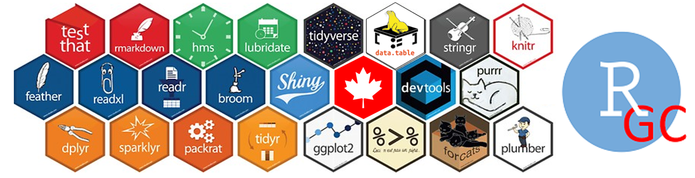

<!-- # (PART\*) Introductory notes{-} -->

<!-- #  Raison d'être  {-} -->
<!-- # Preface {-}  -->
<!-- # About {-} -->

# Raison d'être  {#index .unnumbered}

[{.cover width="100%"}](https://gccollab.ca/groups/profile/7391537/r4gc-use-r-community-use-r)

<!-- This is the workbook of the _R4GC (Use R!) Community_. -->

<!-- ## Book source and credits -->

This book is prepared as part of the R4GC Community  skill enhancing and knowledge gathering  exercise. 

It  aims at consolidating the knowledge-based that is being gathered by the R4GC Community spread across various R4GC community portals and discussions.

It also serves to illustrate - as always with source code - one of the most powerful 
features of R, which is 
<!-- the capability to collaboratively develop data science codes and reports using RMarkdown. -->
the collaborative peer-reviewed development of data science codes and reports using [R Markdown](https://rmarkdown.rstudio.com/).

<!-- ## History & portals {-} -->

## R4GC Community {-}

R4GC Community (formerly called "Use R!" GCCollab community) 
was created in March 2021 to bring together the R users across the Government of Canada.
Here we gather and curate the knowledgebase related to the use of  R  within the Government of Canada. 
Everyone is welcome to join, whether you are an advanced R user, just starting learning it, or simply want to learn more about data science and how it is done.

<!-- ### History -->

The idea to create this group came during the [GC Data2021 Conference](https://www.csps-efpc.gc.ca/events/data-conference2021) workshop on [Data Engineering Challenges and Solutions: Demonstration of Shiny](#gcdata2021) [^gcdata2021].    The highest voted question during the discussion there was : _"How can I get more help for our members to enhance their knowledge and "spread the word" and raise more awareness regard to this tool?"_ The creation of this community group is the answer to this question.

<!-- [^gcdata2021] The full recording of this workshop  -->
<!-- was made  by conference organizers and is available on [YouTube]().  -->
 
By November 2021, the  R4GC  GCCollab group has been become one of the largest active data science practitioners groups in Canada, counting over a quarter  thousand of members. The weekly "Lunch and Learn Data Science with R" meetups organized by the R4GC Community have been attended by data practitioners from over twenty government departments,  and generated
hundreds of questions/answers, a dozen of tutorials, multiple open to use applications, and  thousands of line of open code. 

<!-- On October 29, 2021, the work of this group was presented at the  [2021 International Methodology Symposium](https://www.statcan.gc.ca/en/conferences/symposium2021/index). -->

<!-- This book aims at consolidating all knowledgebase gathered by the R4GC Community at its  portals and meetups -->

### "Lunch and Learn Data Science with R" meetups {-} 

_"Building advanced Data Science skills using R, together - one meeting at a time!"_

These  informal meetings are organized weekly during Friday lunch time (from 12:05 to 12:55). 
There data scientists wanting to upscale their knowledge of R and other Data Science related subjects get together to show and discuss their R codes and share their data coding tricks and methodologies.
Normally, each  session is focused on a particular subject or project with the codes shared on GCcode.

No registration is required to join the meeting.  However, in order to view the notes and  video-recordings from these meetups, you need to join this sub-group: https://gccollab.ca/groups/about/7855030. 
For Agenda and Dial-in MS Teams numbers please see Group Events page at https://gccollab.ca/event_calendar/group/7391537.

 
### Community portals {-}

The R4GC community makes used of the following collaborative platforms provided by Shared Services Canada.

<!-- This book aims at consolidating the knowledge spread across various R4GC community portals, described below. -->

####  GCcode group - r4gc {-}

URL: https://gccode.ssc-spc.gc.ca/r4gc

GCcode is the GitLab solution that is accessible from within the GC network. As such, it allows one to view and update (pull and push) codes and documentation with a single click of button on a GC laptop from an RStudio. The tutorial on how to do it is developed. The 'r4gc' group has been created within GCcodes, where the codes, tutorials and other resources are gathered. It contains three main folders:

 

- /codes. - This is where "raw" (not-reviewed, unedited) R codes contributed by GC community are uploaded. Currently, this includes codes for analyzing and visualizing PSES (Public Service Employee Survey) results, ATIP requests, COVID-19 statistics, and various codes for ease of day to day work and maintenance. Some codes are readily available to become packages, some are short code snippets taken from various blogs,  question and answer portals, such as www.stackoverflow.org and www.rseek.org, and open-source textbooks.

- /gc-packages. - This is where the work on packages being developed from the submitted "raw" codes is happening. Currently it includes repositories for building packages to process PSES results, COVID-19 data, and the utility functions package for data engineering and efficient data processing.

- /resources. - This where the rest of knowledge-base is gathered, including the tutorials, slides, and codes presented at the community weekly ‘Lunch and Learn’ meetups.

#### GCcollab: R4GC (Use R) {-}

URL: 
https://gccollab.ca/groups/profile/7391537/enuse-rfruse-r

GCcollab allows one to participate in the discussion from within and outside GC network (for registered users). This makes it convenient for gathering information from any sources, including those that my not be available from within the GC network. In order to facilitate the curation of knowledge, a number of discussion threads have been created there to address of topics of highest interest for the R4GC community. 
These are reviewed and updated regularly, commonly as part of  community weekly meetups.

<!-- ### GCcollab Subgroup: Lunch and Learn R {-} -->

<!-- URL: https://gccollab.ca/groups/profile/7855030/enfridays-lunch-and-learn-r-meet-upsfr -->

<!-- This subgroup is created for sharing minutes, notes and video-recordings from the community weekly meetups,  -->

#### GCwiki: UseR! {-}

URL: https://wiki.gccollab.ca/UseR!

This platform is used to consolidate all discussion topics in one place and link them with other data science resources in the wiki space.
 

#### GitHub: open-canada  {-}

URL: https://open-canada.github.io/UseR/ 

Inline with the GC policies of open science and open data \ref{#policies}, since most  information gathered by the R4GC community is unclassified and comes from public domain, a public facing organizational account has been created on GitHub (https://github.com/open-canada) for sharing and growing the R4GC community knowledgebase. This is where  public-facing community outputs are gathered, including the growing collection of Web Apps and codes that were built with contributions from GC data scientists using open source tools and data, located at https://github.com/open-canada/Apps 

<!-- ### Slido (r4gc) {-} -->

<!-- URL: https://sli.do.  Code "r4gc" -->

<!-- This platform is used for wider audience forums and conferences. A number of polls have been conducted there, in a addition to opening and ranking new questions. -->

### Community presentations {-}

### International Methodology Symposium (October 2021) {#gcIMS2021 .unnumbered}

The work of the R4GC community was presented at the 
2021 International Methodology Symposium organized by Statistics Canada in October 2021.
The slides for this presentation are available  here: 
[in English](https://docs.google.com/presentation/d/19zu27vrNfgtGKdOjjpqsGkhFnh8a7Ca2/) and [en français](https://docs.google.com/presentation/d/1GaY0bttRUIm67t16XludgCbJMZ_WyO8E/).

### GC Data Conference (February, 2021) {#gcdata2021 .unnumbered}

The earlier work of community members was also presented at the 2021 GC Data Conference Data Literacy Fest Workshop “Data Engineering Challenges and Solutions: Demo of Shiny” in February 2021. The video-recording of this workshop was made available by conference organizers and is available on  [YouTube](https://youtu.be/QWv6E3e7bek). 

<!-- # A propos {-} -->

<!-- # About this book {-} -->

## Book source code {-}

<!-- ## About this book {-} -->

This is book is built using the [bookdown](https://bookdown.org) R package in RStudio.
It is hosted at Open Canada GitHub repo https://open-canada.github.io/r4gc.
The source code of it located at https://github.com/open-canada/r4gc.

<!-- - similar to many great data science textbooks that have been already published and made freely available on github and bookdown.org and other online platforms -->
Thus built, the book enables easy collaboration, transparency and peer-reviewing.

<!-- Additionally, as with any markdown file, in addition to the compiled html file, it also allows one to gather and save  discussion comments and  draft  ideas inside the source Rmd file. -->

## Disclaimer {-}

The views and opinions expressed in this article are those of the authors and do not necessarily reflect the official policy or position of any agency of the Government of Canada.

<!-- ### Other formats {-} -->

<!-- One of the beauties of the `bookdown` R package is that it allows one to generate multiple type of outputs  from the same source .Rmd files. -->
<!-- , such as pdf, epub, and various hmtl formats (single page html, multiple-page two-column and multiple-page three-column formats, with and without interactive menus). -->
<!-- The alternative formats of this R4GC book will be placed here  https://open-canada.github.io/r4gc/alt. -->

<!-- - epub:  -->
<!-- - pdf: -->
<!-- - one-page html -->
<!-- - mulpi-page three-colummn website:  -->

## Contributors {.unnumbered}

<!-- R4GC is a collaborative effort of many people who have contributed to the development of the codes and knowledgebase that is gathered in the R4GC portals and highlighted in this paper: Jonathan Dench, Joseph Stinziano, Henry Luan, Eric Littlewood, Philippe-Israel Morin, Tony Machado, Maxime Girouard, Martin Jean, Tim Roy, Dejan Pavlic, Utku Suleymanoglu. The support from wider international R community through stackoverflow.org portal and knowledge-sharing events ( conferences and webinars ) organized by the RStudio is also gratefully acknowledged. -->

R4GC is a collaborative effort of many people who have contributed to the development of the knowledgebase that is gathered in this book.
They are listed below.

> Jonathan Dench, Joseph Stinziano, Henry Luan, Eric Littlewood, Philippe-Israel Morin, Tony Machado, Maxime Girouard, Martin Jean, Tim Roy, Mehrez Samaali, Sylvain Paquet, Dejan Pavlic, Utku Suleymanoglu, 

Additionally, much support has been also received from wider international R community through stackoverflow.org portal and knowledge-sharing events organized by the RStudio, as well as from several other Government of Canada employees who remained anonymous.

Their help is greatly appreciated.
<!-- and shows, once again, the power of open data science collaboration, where so much can be achieved when peers are help each other  -->

## Licenses {-}

This book is licensed under the [Creative Commons Attribution 4.0](https://creativecommons.org/licenses/by/4.0/) License, and 
is (and will always be) **free to use**.

## Key principles {-}

### Open data, open source, open science {-}

<!-- open government open source , open knowledge -->

This book contains only the information and knowledge that was obtained from public domain, using the [Open Government principles](#open-policies)

<!-- It is licensed under the [Creative Commons Attribution-NonCommercial-NoDerivs 3.0](http://creativecommons.org/licenses/by-nc-nd/3.0/us/) License, and  -->
<!-- is (and will always be) **free to use**. -->

<!-- In concordance with Open Government principles,  -->

### Chatham House Rule  {-}

<!-- Chatham House Rule for dialogue events {-} -->

This book is prepared using [the Chatham House rule](https://www.chathamhouse.org/about-us/chatham-house-rule).
The Chatham House Rule helps create a trusted environment to understand and resolve complex problems through dialog and timely open communication. 
Its guiding spirit is: share the information you receive, but do not reveal the identity of who said it. Hence,  no attributions are made and the identity of speakers
and participants is not disclosed.
It is based on the views and codes
contributed by community members as part of ongoing community events interactions. Offered as
a means to facilitate the discussion, the document does not constitute
an analytical document, nor does it represent any formal position of any
organization involved. 

## How to contribute {-}
<!-- ## Need help? Have idea? Want to contribute? {-} -->

Any chapter of this book can be edited by simply clicking on the "edit" button, which will lead to the corresponding source Rmd file in the book's repo, where you can make a change  in the document (in doing so, this repo will forked at your github account ) and submit ir to the book editor (by submitting the merge request).
Alternatively, you can always contact the R4GC group lead at the contact listed below and attend R4GC weekly meetups.

## About authors  {-}

[Dmitry Gorodnichy](https://www.linkedin.com/in/dmitry-gorodnichy) is Research Data Scientist with the Chief Data Office at the Canadian Border Services Agency. 

[Patrick Little](https://www.linkedin.com/in/patrickjlittle/) is Adviser on the Open Government systems team at the Treasury Board of Canada Secretariat. 

<!-- He is passionate about making the government data and tools open to public -->

<!-- ## Need  help? {-} -->

<!-- - Check `Use R!` GCCollab group: https://gccollab.ca/groups/profile/7391537/ -->
<!-- - Join us  for `Lunch and Learn` meet-up every Friday: https://gccollab.ca/groups/about/7855030 -->
<!-- - Contact us: dmitry.gorodnichy@cbsa-asfc.gc.ca -->

### Contacts {-}

For questions and feedback, please contact 
<!-- the group  moderator  -->
Dmitry Gorodnichy: <dmitry.gorodnichy@cbsa-asfc.gc.ca> 
<!-- or <dmitry@gorodnichy.ca> -->

